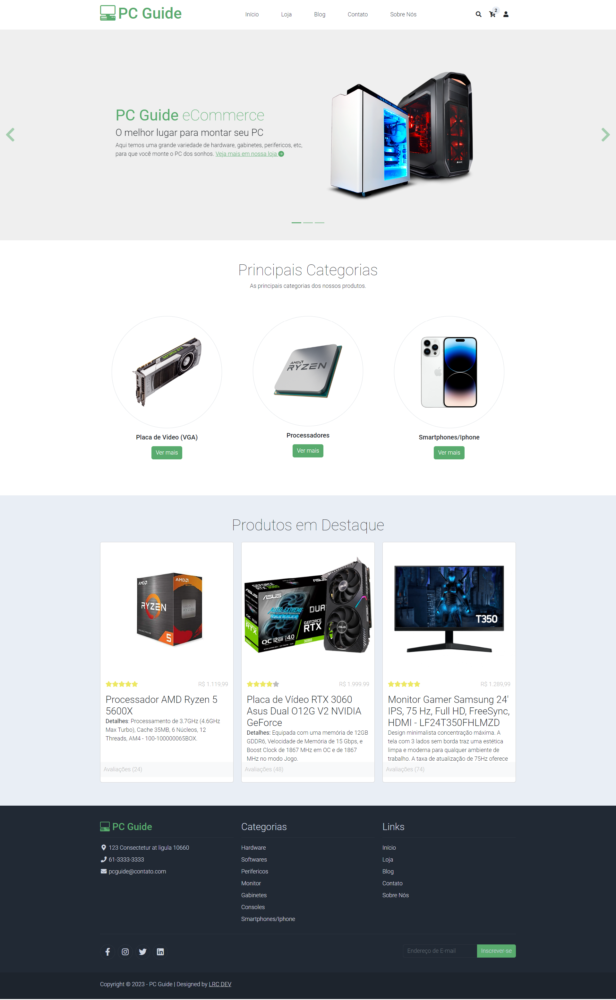

# PC Guide

> PC Guide é uma plataforma que contem tudo relacionado a tecnologia em um só lugar, loja para hardware em geral, smartphones, blog sobre as novidades de tecnologia.



> Projeto em constante desenvolvimento.

### Ajustes e melhorias

Próximas atualizações serão voltadas nas seguintes tarefas:

- Finalizar views de Loja, Sobre Nós, Contato e Blog.
- Consumir API em cada view.
- Realização de autenticação.
- Deploy 

## 💻 Pré-requisitos

* Você instalou a versão mais recente de `<PHP / Composer / Node / Docker (opcional)>`

## 🚀 Instalando <nome_do_projeto>

Para instalar o projeto PC Guide, siga estas etapas:

Linux:

- Clone o repositório:
```
git clone https://github.com/CLucasrodrigues22/pcguide
```
- Instale as dependências do Vue JS:
    - Na raiz do projeto: 
        ```
        cd web/
        ```
        ```
        npm install && npm run dev
        ```
    - Caso queria subir um container no Docker, execute para instalar a imagem da aplicação, com o terminal no diretório web/, digite:
        ```
        docker composer up -d
        ```
Em breve mais descrições;